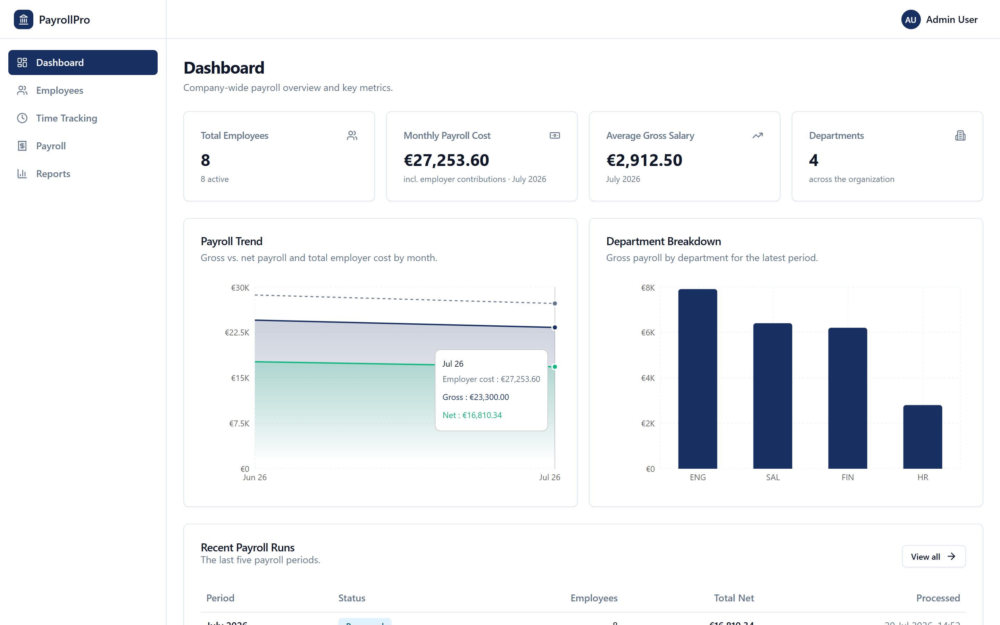
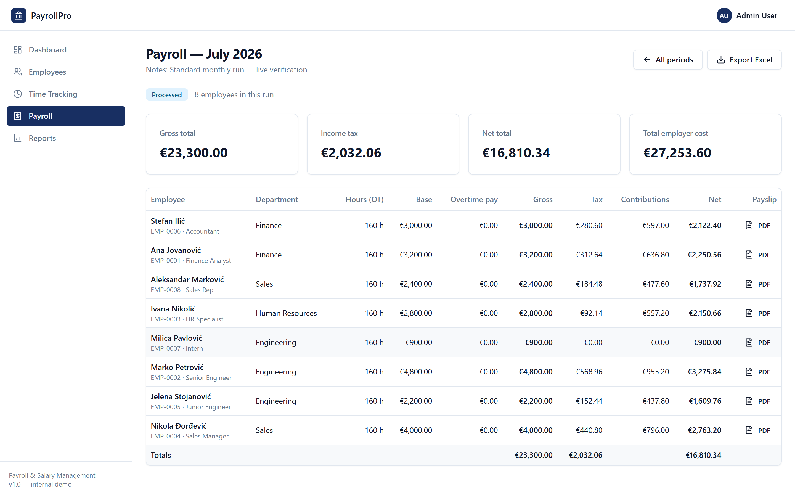
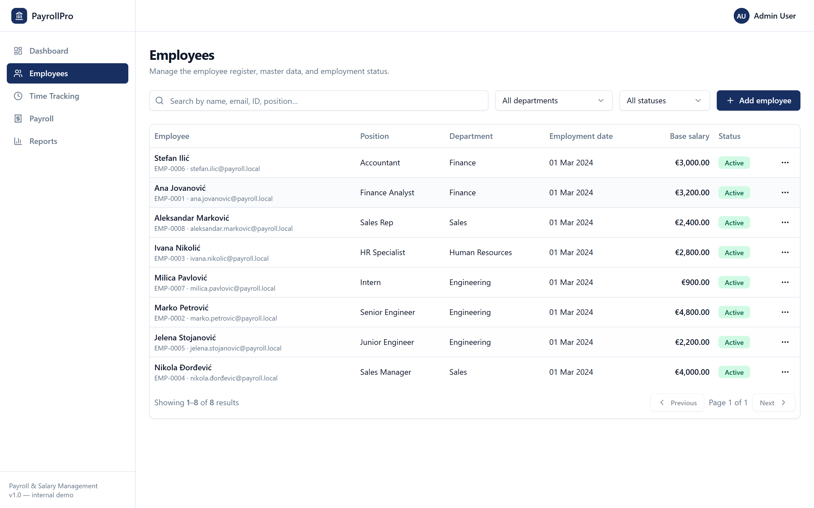
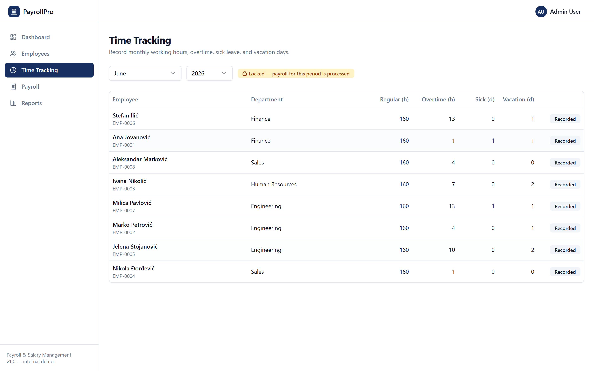
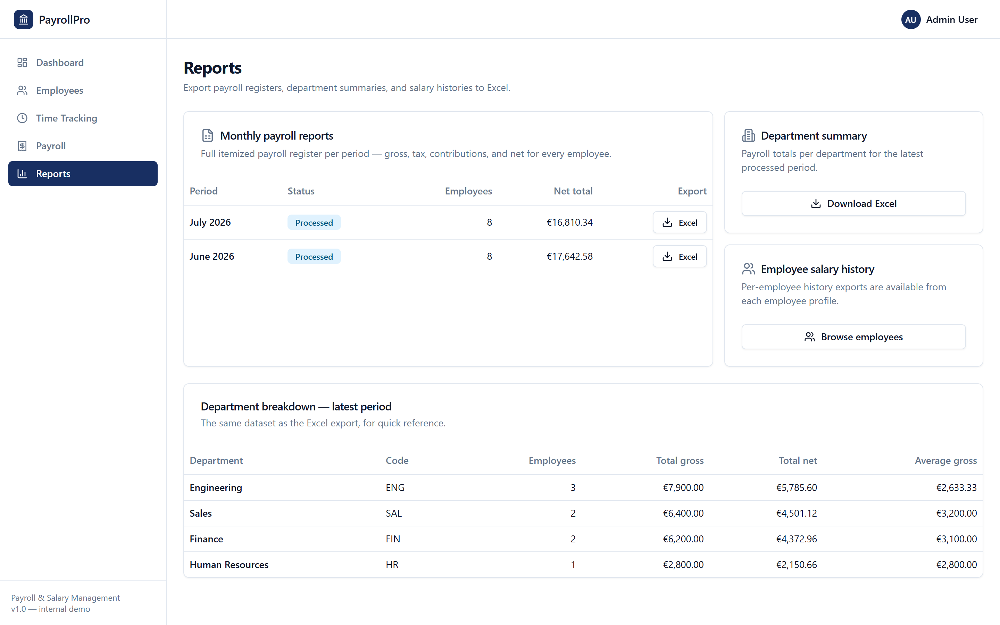
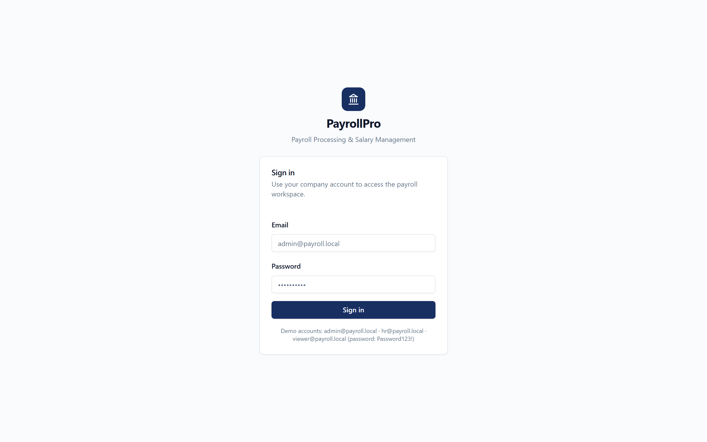
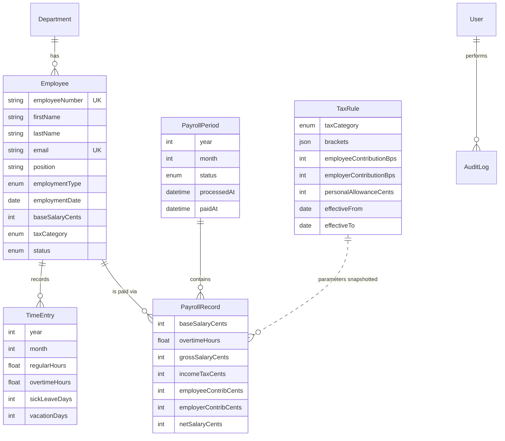

# PayrollPro — Payroll Processing & Salary Management System

An enterprise-grade payroll management system built with **Next.js 15, TypeScript, PostgreSQL, and Prisma** — covering the full payroll lifecycle: employee master data, monthly time tracking, payroll calculation with progressive taxation, immutable payroll history, PDF payslips, and Excel reporting.

> **Portfolio context.** Built as a final-year Information Systems project to demonstrate business-process understanding (payroll operations, financial controls, audit trails) alongside professional software engineering (layered architecture, typed contracts, automated testing, CI/CD).

---

## Table of Contents

1. [Business Problem](#business-problem)
2. [Features](#features)
3. [Screenshots](#screenshots)
4. [Architecture](#architecture)
5. [Database Design](#database-design)
6. [Payroll Calculation Model](#payroll-calculation-model)
7. [Technology Stack](#technology-stack)
8. [Getting Started](#getting-started)
9. [Testing](#testing)
10. [Deployment](#deployment)
11. [Security](#security)
12. [Future Improvements](#future-improvements)
13. [Lessons Learned](#lessons-learned)

---

## Business Problem

Small and mid-sized companies routinely run payroll in spreadsheets: error-prone manual formulas, no audit trail, no access control, and no way to reproduce what was paid six months ago after tax rules changed. Payroll mistakes are expensive — they damage employee trust and create compliance exposure.

**PayrollPro** models how a real payroll department works:

- HR maintains a controlled **employee register** (no hard deletes — history must survive).
- Each month, **working time** is recorded per employee (regular, overtime, sick, vacation).
- An authorized administrator **runs payroll**: the system calculates gross pay, progressive income tax, and social contributions for every active employee **atomically** — either the whole run commits or none of it does.
- Processed runs are **frozen**: tax parameters are snapshotted onto every record so historical payslips remain reproducible even after legislation changes.
- Every mutation is written to an **audit log** with the acting user.

## Features

| Module | Capabilities |
| --- | --- |
| **Dashboard** | Headcount, monthly payroll cost (incl. employer contributions), average salary, 12-month payroll trend, department breakdown, recent runs |
| **Employees** | Create / edit / deactivate–reactivate, search, department & status filters, pagination, per-employee salary history |
| **Time Tracking** | Monthly timesheet grid per employee; entries lock automatically once the period's payroll is processed |
| **Payroll** | One-click monthly run, state machine `DRAFT → PROCESSED → PAID` (+ `CANCELLED`), itemized register per period, totals reconciliation |
| **Payslips** | Professional PDF payslip per employee per period (company header, earnings, deductions, net pay) |
| **Reports** | Excel exports: monthly payroll register, department summary, employee salary history — consistently styled with frozen headers and totals |
| **Administration** | Role-based access (`ADMIN` / `HR` / `VIEWER`), audit trail of every change |

## Screenshots

> Captured from a live run against seeded data.

| Dashboard | Payroll register |
| --- | --- |
|  |  |

| Employees | Time tracking (locked period) |
| --- | --- |
|  |  |

| Reports | Sign in |
| --- | --- |
|  |  |

A generated payslip example: [docs/screenshots/payslip_sample.pdf](docs/screenshots/payslip_sample.pdf)

## Architecture

Feature-based modular architecture with strict layering. **UI components never touch Prisma and never perform money math.**

```
src/
├── app/                    # Next.js App Router (thin: routing, layouts, pages)
│   ├── api/                # Route handlers (PDF payslips, Excel exports)
│   ├── dashboard/          # Authenticated app segment
│   └── login/              # Public auth segment
├── components/
│   ├── ui/                 # shadcn/ui primitives (button, table, dialog…)
│   ├── shared/             # App-level building blocks (pagination, badges…)
│   └── layout/             # Shell (sidebar, user menu)
├── features/               # One module per business capability
│   ├── employees/          #   ├── validation.ts   (Zod schemas — input contracts)
│   ├── time-entries/       #   ├── repository.ts   (ALL Prisma queries)
│   ├── payroll/            #   ├── service.ts      (business rules, transactions)
│   ├── payslips/           #   ├── dto.ts          (UI-facing shapes, cents→decimal)
│   ├── reports/            #   ├── actions.ts      ("use server" boundary)
│   ├── departments/        #   └── components/     (feature UI)
│   └── audit/
└── lib/
    ├── payroll/            # PURE calculation engine — no I/O, fully unit-tested
    ├── auth/               # Auth.js v5 config + server-side role guards
    ├── money.ts            # Integer-cents arithmetic (single source of truth)
    ├── errors.ts           # Typed error hierarchy → safe client messages
    ├── action-result.ts    # Uniform ActionResult<T> envelope for server actions
    ├── rate-limit.ts       # Sliding-window rate limiter
    ├── prisma.ts           # Singleton client
    └── logger.ts           # Structured JSON logging
```

**Request flow:**

```
Client component ──▶ Server Action ──▶ Service ──▶ Repository ──▶ PostgreSQL
                     (authorize,       (business    (Prisma)
                      rate-limit,       rules,
                      Zod-validate)     audit,
                                        transactions)
                            │
                            └──▶ lib/payroll/engine  (pure, deterministic)
```

Key decisions and their tradeoffs:

| Decision | Rationale | Tradeoff |
| --- | --- | --- |
| **Money as integer cents** everywhere | IEEE-754 floats are unacceptable for payroll; `0.1 + 0.2 ≠ 0.3` | Conversion at the DTO edge must be disciplined (enforced by convention + tests) |
| **Pure calculation engine** isolated from framework | Deterministic, exhaustively testable, portable | Service layer must marshal inputs explicitly |
| **Tax parameters snapshotted** onto each payroll record | Historical payslips reproducible after rule changes — a legal requirement in real payroll | Deliberate denormalization (documented in schema) |
| **Soft-delete employees only** | Payroll history references employees; deletion would orphan financial records | Register grows over time; mitigated with status filters |
| **JWT sessions** (no DB session table reads) | Role available in middleware without a DB roundtrip | Role changes take effect on next sign-in |

## Database Design

Normalized relational schema (PostgreSQL, managed by Prisma migrations):



Notable constraints:

- `@@unique([employeeId, year, month])` — one timesheet per employee per month
- `@@unique([periodId, employeeId])` — one payroll record per employee per run
- `@@unique([year, month])` — one payroll period per month
- `onDelete: Restrict` from `PayrollRecord` to `Employee` — financial history cannot be orphaned

## Payroll Calculation Model

Simplified but realistic European-style model (all rates configurable per **versioned, effective-dated `TaxRule`**):

```
hourlyRate      = baseSalary / 160
overtimePay     = hourlyRate × overtimeHours × 1.5
gross           = baseSalary + overtimePay
employeeContrib = gross × 19.9%                      (social security)
taxable         = max(0, gross − employeeContrib − personalAllowance)
incomeTax       = progressive brackets over `taxable`:
                    ≤ €1,500 → 10%   │  €1,500–4,000 → 20%   │  > €4,000 → 30%
net             = gross − employeeContrib − incomeTax
employerCost    = gross × (1 + 17.65%)               (reported, not deducted)
```

Invariant verified by tests: **`gross = net + incomeTax + employeeContrib`** — the run always reconciles to the cent.

## Technology Stack

| Layer | Technology |
| --- | --- |
| Framework | Next.js 15 (App Router, Server Actions, Route Handlers) |
| Language | TypeScript (strict, `noUncheckedIndexedAccess`) |
| UI | Tailwind CSS, shadcn/ui (Radix primitives), lucide-react, sonner |
| Charts | Recharts |
| Database | PostgreSQL 16, Prisma ORM |
| Auth | Auth.js v5 (credentials + bcrypt, JWT sessions, RBAC) |
| Documents | @react-pdf/renderer (payslips), ExcelJS (reports) |
| Validation | Zod (shared client/server contracts) |
| Testing | Vitest + Testing Library |
| CI/CD | GitHub Actions → Vercel |
| Containers | Docker multi-stage build + docker-compose |

## Getting Started

### Prerequisites

- Node.js ≥ 20
- Docker (for local PostgreSQL) — or any reachable Postgres instance

### 1. Clone & install

```bash
git clone https://github.com/<your-username>/payroll-management-system.git
cd payroll-management-system
npm install
```

### 2. Configure environment

```bash
cp .env.example .env
# then edit .env — at minimum set a real AUTH_SECRET:
#   openssl rand -base64 32
```

### 3. Start the database

```bash
docker compose up -d db
```

### 4. Migrate & seed

```bash
npx prisma migrate deploy   # applies prisma/migrations
npx prisma db seed          # demo users, departments, employees, one processed payroll
```

### 5. Run

```bash
npm run dev
```

Open <http://localhost:3000> and sign in with a demo account:

| Role | Email | Password |
| --- | --- | --- |
| ADMIN | `admin@payroll.local` | `Password123!` |
| HR | `hr@payroll.local` | `Password123!` |
| VIEWER | `viewer@payroll.local` | `Password123!` |

> **Windows note:** if the project path contains `&` (e.g. `Payroll Processing & Salary Calculator`), `npm run` scripts may fail under `cmd.exe`. Run the underlying binaries via Git Bash (e.g. `node_modules/.bin/next dev`) or move the project to a path without `&`.

## Testing

```bash
npm test              # unit + business-logic suites
npm run test:coverage # with V8 coverage report
```

The test pyramid focuses on where the risk is:

- **`lib/payroll/engine.test.ts`** — bracket mathematics, overtime, allowance edge cases, determinism, integer-cents guarantee, and the reconciliation invariant.
- **`features/payroll/service.test.ts`** — payroll workflow state machine: double-processing rejection, missing-tax-rule failure, atomic snapshot on run, `PROCESSED → PAID` transitions, cancellation rules (mocked I/O).
- **`features/employees/service.test.ts`** — uniqueness rules, cents conversion, soft-deactivation invariants.
- **CI integration job** — applies migrations and the seed against a real PostgreSQL 16 service container, then builds the app (catches schema/SQL drift that unit tests cannot).

## Deployment

### Vercel (recommended)

1. Push the repository to GitHub and import it in Vercel (**Add New… → Project → Import**).
2. Provision a Postgres instance (Vercel Postgres / Neon / Supabase) and copy the **direct (unpooled)** connection string — migrations run at build time and need a direct connection.
3. Set environment variables in Vercel → *Project Settings → Environment Variables* (all environments): `DATABASE_URL`, `AUTH_SECRET` (`openssl rand -base64 32`), `COMPANY_NAME`, `COMPANY_ADDRESS`, `COMPANY_TAX_ID`.
4. The **Build Command** is defined in [`vercel.json`](vercel.json) — `prisma generate && next build`. Migrations are applied **out-of-band** (not during the build), which keeps the build fast and free of any database dependency — the recommended production pattern.
5. Before the first deploy (or after any schema change), apply migrations and seed from your machine against the production DB:
   ```bash
   DATABASE_URL="<prod-direct-url>" npx prisma migrate deploy
   DATABASE_URL="<prod-direct-url>" npx prisma db seed     # first time only, for demo data
   ```

### Docker (self-hosted)

```bash
docker compose up --build
# app on http://localhost:3000 — migrations apply automatically on boot
```

### CI pipeline

`.github/workflows/ci.yml` runs on every push/PR:

1. **quality** — ESLint, `tsc --noEmit`, Vitest suites
2. **build** — `prisma migrate deploy` + `prisma db seed` against a disposable Postgres 16, then a production `next build`

## Security

- **Authentication** — Auth.js v5 credentials flow, bcrypt-hashed passwords, JWT sessions.
- **Authorization** — enforced server-side in *every* action and route handler (`requireRole`), not just in middleware or UI. Role hierarchy `ADMIN ⊃ HR ⊃ VIEWER`.
- **Validation** — Zod schemas at every boundary; server re-validates regardless of client checks.
- **Rate limiting** — sliding-window limits on login, writes, and document generation (interface designed to swap in Redis for multi-instance deployments).
- **Error hygiene** — typed `AppError` hierarchy; unknown errors are logged server-side and never leaked to clients.
- **Secrets** — runtime-validated via `lib/env.ts` (fail-fast on missing/invalid configuration); `.env` is git-ignored with a documented `.env.example`.
- **Auditability** — every mutation records actor, entity, and metadata in `AuditLog`.

## Future Improvements

- **Approval workflow** — four-eyes principle: HR prepares a run, a second approver releases payment.
- **Bank export** — SEPA XML (pain.001) generation for actual disbursement.
- **Email delivery** — send payslips to employees automatically after a run is marked paid.
- **Multi-currency & localization** — per-country tax rule packs; i18n of the UI.
- **Redis-backed rate limiting & caching** for horizontal scaling.
- **E2E tests** (Playwright) covering the full run-payroll journey.
- **Accrual accounting export** — journal entries (debit salary expense / credit liabilities) to ERP.

## Lessons Learned

- **Money is a domain type, not a number.** Committing to integer cents end-to-end eliminated an entire category of bugs — but only because the conversion happens in exactly one layer (DTOs). Discipline beats cleverness.
- **Immutability is a business rule, not a technical one.** "Why can't I edit March's hours?" — because March's payroll is processed. Encoding that as a service-layer guard (and a UI lock) mirrors real payroll controls.
- **Pure functions pay rent.** Extracting the calculation engine made the hardest logic in the system the easiest to test — 12 test cases run in milliseconds with zero mocks.
- **Layering is only real if it's enforced.** Repositories being the *only* Prisma consumers meant service tests needed no database at all — the boundary proved itself.
- **State machines beat status booleans.** Modeling `DRAFT → PROCESSED → PAID / CANCELLED` explicitly made invalid transitions unrepresentable and the audit trail meaningful.

---

**License:** MIT (portfolio/demonstration project — the tax model is simplified and not suitable for production payroll without jurisdiction-specific rules).
